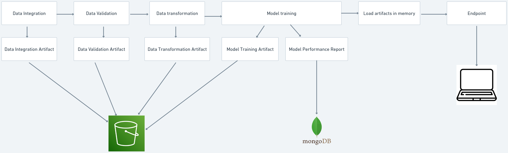
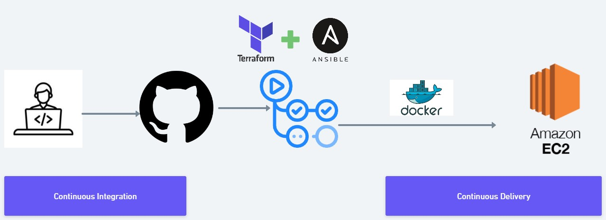

# Credit card default prediction

[](https://github.com/vivekvedant/credit_card_default_prediction/actions/workflows/main.yml)
## **Problem Statement**

Credit card default is a significant concern for financial institutions. Predicting credit card defaults accurately can help mitigate risks and make informed decisions regarding creditworthiness. The challenge is to develop a model that can accurately predict whether a credit cardholder is likely to default on their payments based on historical data.

### **Dataset Link**
https://archive.ics.uci.edu/dataset/350/default+of+credit+card+clients

## **Solution**

The Credit Card Default Prediction project offers a machine learning-based solution to address the problem statement. By leveraging historical credit card data, the project aims to build a predictive model that can classify credit cardholders as either likely to default or not likely to default.

## **Project Architecture**


## **Deployment Architecture**



## **Tech Stack**

1. Python

2. Machine Learning

3. GitHub Actions

4. MongoDB 

5. Docker 

6. Terraform

7. Ansible

## **Infrastructure required**
1. AWS EC2

2. AWS ECR

3. AWS S3

4. AWS DynamoDB


## **Run Project in local**


1. Clone the git repo
    ```
    git clone https://github.com/vivekvedant/credit_card_default_prediction.git
    ```

2. Change directory 
    ```
    cd credit_card_default_prediction
    ```

2. Install requirements
    ```
    pip install -r reqirement.txt
    ```
3. Export Enviornment variables
    ```
    export MONGODB_URL =  <url of mongodb>
    export AWS_ACCESS_KEY_ID = <AWS Access Id>
    export AWS_SECRET_ACCESS_KEY  = <AWS Secret Id>
    
    ```
4. Create s3 in aws with name credit-default-data-versioning or change S3_BUCKET_NAME in training_pipeline constant


### **Without Docker**

5. Run application
    ```
    uvicorn src.app:app
    ```

6. Upload Data into S3 bucket
   ```
   http://localhost/upload_data
   ```

7. Train model
    ```
    http://localhost/train
    ```

8. Predict on data
    ```
    http://localhost/predict
    ```

9.  FastAPI docs url
    ```
    http://localhost/docs
    ```

### **With Docker**

1. Docker build
    ```
    docker build -t credit_card_default_prediction .
    ```

2. Run docker image
    ```
    docker run  -d  -e MONGODB_URL=$MONGODB -e AWS_ACCESS_KEY_ID=$AWS_ACCESS_KEY_ID -e AWS_SECRET_ACCESS_KEY=$AWS_SECRET_ACCESS_KEY -p 80:80 credit_card_default_prediction
    ```